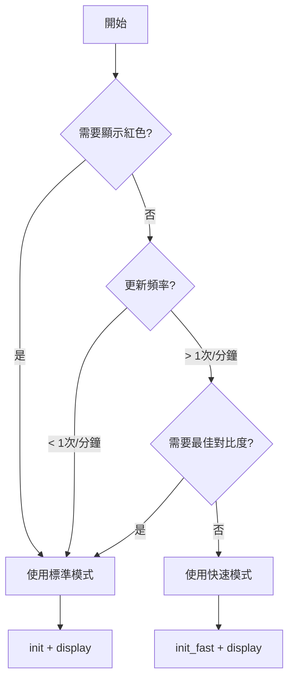

# 7.5 吋三色電子紙 (黑/白/紅) 知識文件

> 基於 Waveshare 7.5inch e-Paper B V3 與 Raspberry Pi Pico (MicroPython) 的實測經驗整理
> 最後更新：2026-01-11

---

## 目錄

1. [規格摘要](#1-規格摘要)
2. [可用 API 與功能說明](#2-可用-api-與功能說明)
3. [使用範例程式](#3-使用範例程式)
4. [模式使用建議](#4-模式使用建議)
5. [常見問題與注意事項](#5-常見問題與注意事項)

---

## 1. 規格摘要

### 1.1 基本規格

| 項目 | 規格 |
|:---|:---|
| 型號 | Waveshare 7.5inch e-Paper B V3 |
| 解析度 | 800 × 480 像素 |
| 顏色 | 黑、白、紅 (三色) |
| 顯示區域 | 163.2 × 97.92 mm |
| 像素間距 | 0.204 × 0.204 mm |
| 外觀尺寸 | 170.2 × 111.2 × 1.20 mm |
| 重量 | 43.9 ± 0.5 g |
| 通訊介面 | 4-wire SPI (預設) / 3-wire SPI |
| 工作電壓 | VCI: 2.3~3.6V (典型 3.3V) |

### 1.2 電氣特性

| 項目 | 典型值 | 單位 |
|:---|:---|:---|
| 工作電流 | 6.6 | mA |
| 睡眠模式電流 | 20 | μA |
| 深度睡眠電流 | 15 | μA |
| 畫面更新時間 | 15 | 秒 |
| 工作溫度 | 0 ~ 40 | °C |
| 儲存溫度 | -25 ~ 40 | °C |

### 1.3 關鍵特性

- ✅ 雙穩態 (斷電後仍顯示最後畫面)
- ✅ 純反射式顯示 (不發光，類似紙張)
- ✅ 超廣視角
- ✅ 內建顯示 RAM (SRAM)
- ✅ 內建溫度感測器
- ✅ 內建升壓電路 (DC-DC)
- ❌ **不支援真正的局部更新** (局部更新模式僅限黑白且有限制)

### 1.4 硬體接線 (Raspberry Pi Pico)

| E-Paper 腳位 | 名稱 | Pico GPIO |
|:---|:---|:---|
| 14 | DIN (MOSI) | GP11 (SPI1 TX) |
| 13 | CLK (SCK) | GP10 (SPI1 SCK) |
| 12 | CS# | GP9 |
| 11 | D/C# | GP8 |
| 10 | RES# | GP12 |
| 9 | BUSY | GP13 |
| 15 | VDDIO | 3.3V |
| 16 | VCI | 3.3V |
| 17 | VSS | GND |

---

## 2. 可用 API 與功能說明

### 2.1 類別初始化

```python
from machine import Pin, SPI
import framebuf
import utime

epd = EPD_7in5_B(spi_bus=1, rst=12, dc=8, cs=9, busy=13)
```

| 參數 | 預設值 | 說明 |
|:---|:---|:---|
| `spi_bus` | 1 | SPI 匯流排編號 (0 或 1) |
| `rst` | 12 | 重置腳位 |
| `dc` | 8 | 資料/指令選擇腳位 |
| `cs` | 9 | 片選腳位 |
| `busy` | 13 | 忙碌狀態腳位 |

### 2.2 初始化模式

| 方法 | 說明 | 使用場景 |
|:---|:---|:---|
| `init()` | 標準初始化 (預設) | 一般使用，最穩定 |
| `init_fast()` | 快速初始化 | 犧牲少許對比度換取速度 |
| `init_partial()` | 局部更新模式初始化 | 僅限黑白區域更新 |

### 2.3 畫面操作 API

| 方法 | 說明 | 注意 |
|:---|:---|:---|
| `clear(color)` | 清除畫面為單一顏色 | `color`: "white"/"black"/"red" |
| `display()` | 將 buffer 資料刷新到螢幕 | 會等待 BUSY 完成 |
| `sleep()` | 進入深度睡眠 | 最省電 (~15μA) |
| `wake_up()` | 從睡眠中喚醒 | 需重新發送畫面 |

### 2.4 繪圖 API (使用 FrameBuffer)

| 方法 | 說明 |
|:---|:---|
| `imageblack.pixel(x, y, color)` | 設定黑白像素 (0=黑, 1=白) |
| `imagerd.pixel(x, y, color)` | 設定紅色像素 (0=無紅, 1=紅) |
| `imageblack.fill(color)` | 填滿黑白 buffer |
| `imagerd.fill(color)` | 填滿紅色 buffer |
| `imageblack.text(text, x, y, color)` | 繪製文字 (僅黑白) |
| `imagerd.text(text, x, y, color)` | 繪製文字 (僅紅色) |
| `imageblack.line(x0,y0,x1,y1,color)` | 繪製直線 |
| `imageblack.rect(x,y,w,h,color)` | 繪製矩形框 |
| `imageblack.fill_rect(x,y,w,h,color)` | 繪製填充矩形 |

### 2.5 進階設定 API (效能優化)

| 方法 | 說明 | 參數範圍 |
|:---|:---|:---|
| `set_spi_speed(baudrate)` | 調整 SPI 速率 | 1M ~ 10M Hz |
| `set_frame_rate(fps)` | 調整幀率 | 5 ~ 200 Hz |
| `set_voltage(vgh, vdh, vdl)` | 調整驅動電壓 | 見下表 |

**電壓設定參數：**

| 參數 | 選項 | 影響 |
|:---|:---|:---|
| VGH/VGL | 9V ~ 20V | 越高對比度越好，越耗電 |
| VDH | 10V ~ 15V | 影響黑白顯示品質 |
| VDL | -10V ~ -15V | 影響黑白顯示品質 |

---

## 3. 使用範例程式

### 3.1 完整可用程式碼

```python
"""
7.5inch e-Paper B V3 完整控制程式
Raspberry Pi Pico / MicroPython
"""

from machine import Pin, SPI
import framebuf
import utime

# ==================== 顯示解析度 ====================
EPD_WIDTH = 800
EPD_HEIGHT = 480

# ==================== 預設腳位 ====================
RST_PIN = 12
DC_PIN = 8
CS_PIN = 9
BUSY_PIN = 13


class EPD_7in5_B:
    # 顏色常數
    BLACK = 0
    WHITE = 1
    RED = 2
    
    def __init__(self, spi_bus=1, rst=RST_PIN, dc=DC_PIN, cs=CS_PIN, busy=BUSY_PIN):
        self.rst_pin = Pin(rst, Pin.OUT)
        self.dc_pin = Pin(dc, Pin.OUT)
        self.cs_pin = Pin(cs, Pin.OUT)
        self.busy_pin = Pin(busy, Pin.IN, Pin.PULL_UP)
        
        self.width = EPD_WIDTH
        self.height = EPD_HEIGHT
        
        # SPI 初始化
        self.spi = SPI(spi_bus)
        self.spi.init(baudrate=4000000, polarity=0, phase=0)
        
        # 雙 buffer
        self.buffer_black = bytearray(self.height * self.width // 8)
        self.buffer_red = bytearray(self.height * self.width // 8)
        self.imageblack = framebuf.FrameBuffer(
            self.buffer_black, self.width, self.height, framebuf.MONO_HLSB)
        self.imagered = framebuf.FrameBuffer(
            self.buffer_red, self.width, self.height, framebuf.MONO_HLSB)
        
        # 初始化
        self.init()
    
    # ==================== 底層通訊 ====================
    def _digital_write(self, pin, value):
        pin.value(value)
    
    def _digital_read(self, pin):
        return pin.value()
    
    def _delay_ms(self, ms):
        utime.sleep(ms / 1000.0)
    
    def _send_command(self, cmd):
        self._digital_write(self.dc_pin, 0)
        self._digital_write(self.cs_pin, 0)
        self.spi.write(bytearray([cmd]))
        self._digital_write(self.cs_pin, 1)
    
    def _send_data(self, data):
        self._digital_write(self.dc_pin, 1)
        self._digital_write(self.cs_pin, 0)
        self.spi.write(bytearray([data]))
        self._digital_write(self.cs_pin, 1)
    
    def _send_data_bytes(self, data_bytes):
        self._digital_write(self.dc_pin, 1)
        self._digital_write(self.cs_pin, 0)
        self.spi.write(data_bytes)
        self._digital_write(self.cs_pin, 1)
    
    def _reset(self):
        self._digital_write(self.rst_pin, 1)
        self._delay_ms(200)
        self._digital_write(self.rst_pin, 0)
        self._delay_ms(2)
        self._digital_write(self.rst_pin, 1)
        self._delay_ms(200)
    
    def _wait_until_idle(self):
        while self._digital_read(self.busy_pin) == 0:
            self._delay_ms(10)
        self._delay_ms(10)
    
    def _turn_on_display(self):
        self._send_command(0x12)  # DISPLAY REFRESH
        self._delay_ms(100)
        self._wait_until_idle()
    
    # ==================== 初始化 ====================
    def init(self):
        """標準初始化 (Waveshare 官方，最穩定)"""
        self._reset()
        
        self._send_command(0x01)  # POWER SETTING
        self._send_data(0x07)
        self._send_data(0x07)
        self._send_data(0x3f)
        self._send_data(0x3f)
        
        self._send_command(0x06)  # BOOSTER SOFT START
        self._send_data(0x17)
        self._send_data(0x17)
        self._send_data(0x28)
        self._send_data(0x17)
        
        self._send_command(0x04)  # POWER ON
        self._delay_ms(100)
        self._wait_until_idle()
        
        self._send_command(0x00)  # PANEL SETTING
        self._send_data(0x0F)
        
        self._send_command(0x61)  # RESOLUTION (800x480)
        self._send_data(0x03)
        self._send_data(0x20)
        self._send_data(0x01)
        self._send_data(0xE0)
        
        self._send_command(0x50)  # VCOM INTERVAL
        self._send_data(0x11)
        self._send_data(0x07)
        
        self._send_command(0x60)  # TCON
        self._send_data(0x22)
    
    def init_fast(self):
        """快速初始化 (犧牲少許對比度)"""
        self._reset()
        
        self._send_command(0x00)
        self._send_data(0x0F)
        
        self._send_command(0x04)
        self._delay_ms(100)
        self._wait_until_idle()
        
        self._send_command(0x06)
        self._send_data(0x27)
        self._send_data(0x27)
        self._send_data(0x18)
        self._send_data(0x17)
        
        self._send_command(0xE0)
        self._send_data(0x02)
        self._send_command(0xE5)
        self._send_data(0x5A)
        
        self._send_command(0x50)
        self._send_data(0x11)
        self._send_data(0x07)
        
        self._send_command(0x61)
        self._send_data(0x03)
        self._send_data(0x20)
        self._send_data(0x01)
        self._send_data(0xE0)
        
        self._send_command(0x60)
        self._send_data(0x22)
    
    # ==================== 畫面操作 ====================
    def clear(self, color="white"):
        """清除畫面"""
        if color == "white":
            self.imageblack.fill(0xFF)
            self.imagered.fill(0x00)
        elif color == "black":
            self.imageblack.fill(0x00)
            self.imagered.fill(0x00)
        elif color == "red":
            self.imageblack.fill(0xFF)
            self.imagered.fill(0xFF)
        self.display()
    
    def display(self):
        """刷新畫面"""
        high = self.height
        wide = self.width // 8 if self.width % 8 == 0 else self.width // 8 + 1
        
        self._send_command(0x10)  # 黑白資料
        for i in range(wide):
            start = i * high
            end = (i + 1) * high
            self._send_data_bytes(self.buffer_black[start:end])
        
        self._send_command(0x13)  # 紅色資料
        for i in range(wide):
            start = i * high
            end = (i + 1) * high
            self._send_data_bytes(self.buffer_red[start:end])
        
        self._turn_on_display()
    
    def sleep(self):
        """進入深度睡眠"""
        self._send_command(0x02)  # POWER OFF
        self._wait_until_idle()
        self._send_command(0x07)  # DEEP SLEEP
        self._send_data(0xA5)
    
    def wake_up(self):
        """從睡眠喚醒"""
        self._send_command(0x04)  # POWER ON
        self._delay_ms(100)
        self._wait_until_idle()
    
    # ==================== 繪圖輔助 ====================
    def set_pixel(self, x, y, color):
        """設定單一像素"""
        if x < 0 or x >= self.width or y < 0 or y >= self.height:
            return
        if color == self.BLACK:
            self.imageblack.pixel(x, y, 0)
            self.imagered.pixel(x, y, 0)
        elif color == self.WHITE:
            self.imageblack.pixel(x, y, 1)
            self.imagered.pixel(x, y, 0)
        elif color == self.RED:
            self.imageblack.pixel(x, y, 1)
            self.imagered.pixel(x, y, 1)
    
    def draw_rect(self, x, y, w, h, color, fill=False):
        """繪製矩形"""
        if fill:
            for i in range(x, min(x + w, self.width)):
                for j in range(y, min(y + h, self.height)):
                    self.set_pixel(i, j, color)
        else:
            # 上邊
            for i in range(x, min(x + w, self.width)):
                self.set_pixel(i, y, color)
            # 下邊
            if h > 1:
                for i in range(x, min(x + w, self.width)):
                    self.set_pixel(i, min(y + h - 1, self.height - 1), color)
            # 左邊
            if h > 2:
                for j in range(y + 1, min(y + h - 1, self.height)):
                    self.set_pixel(x, j, color)
            # 右邊
            if w > 1 and h > 2:
                for j in range(y + 1, min(y + h - 1, self.height)):
                    self.set_pixel(min(x + w - 1, self.width - 1), j, color)


# ==================== 範例主程式 ====================
if __name__ == '__main__':
    epd = EPD_7in5_B()
    
    # 1. 文字顯示
    epd.clear("white")
    epd.imageblack.text("Hello Waveshare!", 10, 10, 0x00)
    epd.imagered.text("7.5 inch e-Paper", 10, 40, 0xFF)
    epd.imageblack.text("Black / White / Red", 10, 70, 0x00)
    epd.display()
    utime.sleep(3)
    
    # 2. 幾何圖形
    epd.clear("white")
    epd.imageblack.vline(10, 100, 60, 0x00)
    epd.imagered.hline(10, 100, 110, 0xFF)
    epd.imagered.line(10, 100, 120, 160, 0xFF)
    epd.display()
    utime.sleep(3)
    
    # 3. 矩形
    epd.clear("white")
    epd.imageblack.rect(10, 200, 50, 80, 0x00)
    epd.imageblack.fill_rect(70, 200, 50, 80, 0x00)
    epd.imagered.rect(10, 300, 50, 80, 0xFF)
    epd.imagered.fill_rect(70, 300, 50, 80, 0xFF)
    epd.display()
    utime.sleep(3)
    
    # 4. 清除並進入睡眠
    epd.clear("white")
    epd.sleep()
    print("程式結束")
```

---

## 4. 模式使用建議

### 4.1 三種模式對比

| 模式 | 初始化方法 | 刷新時間 | 對比度 | 功耗 | 適用場景 |
|:---|:---|:---|:---|:---|:---|
| **標準模式** | `init()` | ~15秒 | 最佳 | 正常 | 一般用途 (預設) |
| **快速模式** | `init_fast()` | ~12秒 | 略降 | 正常 | 頻繁更新 |
| **局部模式** | `init_partial()` | ~5-10秒 | 較差 | 較低 | 黑白區域更新 |

### 4.2 使用決策樹



### 4.3 功耗最佳化建議

```python
# ✅ 正確：更新後立即進入睡眠
def update_and_sleep(epd):
    epd.display()           # 更新畫面
    epd.sleep()             # 立即睡眠

# ❌ 錯誤：閒置浪費電力
def update_and_wait(epd):
    epd.display()
    utime.sleep(60)         # 空轉 60 秒，浪費電力
    # 沒有進入睡眠
```

### 4.4 各場景最佳實踐

| 應用場景 | 推薦模式 | 額外建議 |
|:---|:---|:---|
| 電子貨架標籤 | 標準模式 | 更新後立即睡眠 |
| 電子時鐘 (無紅) | 快速模式 + 局部更新 | 只更新數字區域 |
| 電子看板 | 標準模式 | 降低電壓以延長壽命 |
| 電池供電設備 | 標準模式 | 務必使用 `sleep()` |
| 頻繁更新 (每分鐘) | 快速模式 | 調高幀率到 10Hz |
| 展示靜態圖片 | 標準模式 | 可完全不供電 (雙穩態) |

### 4.5 不建議使用的功能

| 功能 | 原因 | 替代方案 |
|:---|:---|:---|
| 局部更新 (`init_partial`) | 僅限黑白、限制多、不穩定 | 使用黑白電子紙或標準模式 |
| 3-wire SPI | 需要額外處理 D/C 位元 | 使用 4-wire SPI (預設) |
| 自訂 LUT 波形 | 複雜、易出錯、可能損壞面板 | 使用內建 OTP LUT |

---

## 5. 常見問題與注意事項

### 5.1 畫面沒反應？

請依序檢查：
1. 確認所有接線正確 (特別是 BUSY 和 RST)
2. 確認電子紙模組有獨立供電 (Pico 的 3.3V 可能不足)
3. 確認 SPI 速率不超過 10MHz
4. 確認已呼叫 `display()` 而不是只修改 buffer

### 5.2 顯示殘影或鬼影？

- 這是電子紙的正常現象
- 解決方法：執行一次完整的 `clear("white")` 再重新顯示
- 預防：避免頻繁局部更新

### 5.3 紅色顯示不純或偏淡？

- 檢查 `init()` 是否正確執行
- 確認紅色資料寫入 `imagered` buffer 而非 `imageblack`
- 嘗試調高 VDH 電壓 (15V 為典型值)

### 5.4 更新時間太長？

- 這是電子紙的物理限制 (15秒)
- 無法大幅縮短
- 如需快速更新，請改用 TFT LCD 或 OLED

### 5.5 記憶體不足？

- 雙 buffer 約需要 (800×480/8)×2 = 96KB
- Pico 有 264KB RAM，足夠使用
- 如仍不足，可考慮壓縮或分段傳輸

### 5.6 重要注意事項

| 事項 | 說明 |
|:---|:---|
| ⚠️ 不要頻繁刷新 | 每分鐘超過 1 次可能影響壽命 |
| ⚠️ 避免彎折 FPC | 排線脆弱，易斷裂 |
| ⚠️ 防靜電 | 操作前觸摸金屬接地 |
| ⚠️ 儲存環境 | 23±3°C, 55±10% RH |
| ⚠️ 避免陽光直射 | 會加速面板老化 |

---

## 附錄 A：指令表快速參考

| 指令 | 代碼 | 說明 |
|:---|:---|:---|
| PANEL_SETTING | 0x00 | 面板模式設定 |
| POWER_SETTING | 0x01 | 電源設定 |
| POWER_OFF | 0x02 | 關閉電源 |
| POWER_ON | 0x04 | 開啟電源 |
| BOOSTER_SOFT_START | 0x06 | 升壓軟啟動 |
| DEEP_SLEEP | 0x07 | 深度睡眠 |
| DTM1 | 0x10 | 黑白資料傳輸 |
| DISPLAY_REFRESH | 0x12 | 畫面刷新 |
| DTM2 | 0x13 | 紅色資料傳輸 |
| PLL_CONTROL | 0x30 | PLL 頻率控制 |
| VCOM_INTERVAL | 0x50 | VCOM 間隔設定 |
| RESOLUTION | 0x61 | 解析度設定 |

---

## 附錄 B：版本歷史

| 日期 | 版本 | 說明 |
|:---|:---|:---|
| 2026-01-11 | v1.0 | 初始版本，基於實測結果整理 |

---

*本文件可作為後續開發的參考，避免重複查閱規格書與除錯。*